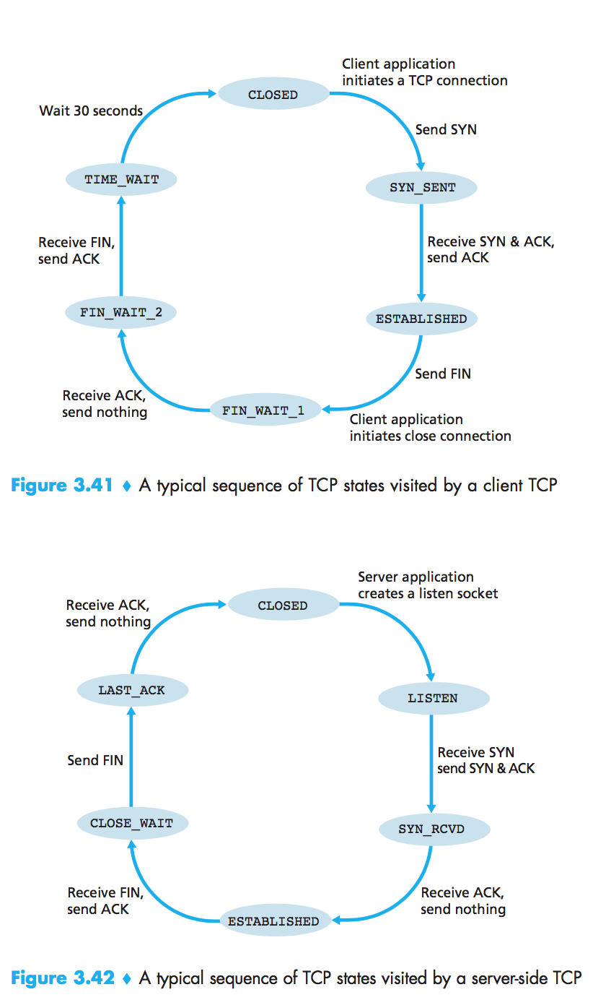
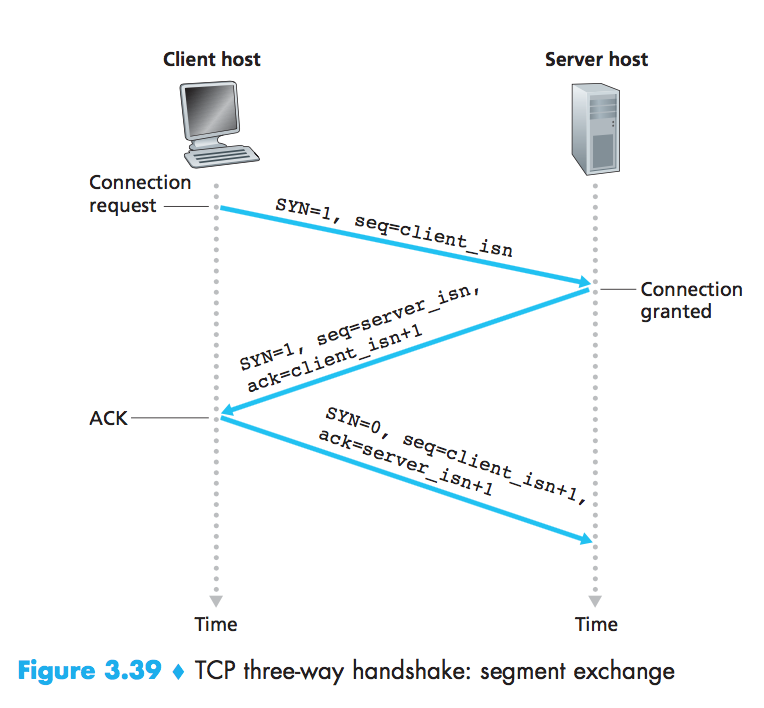
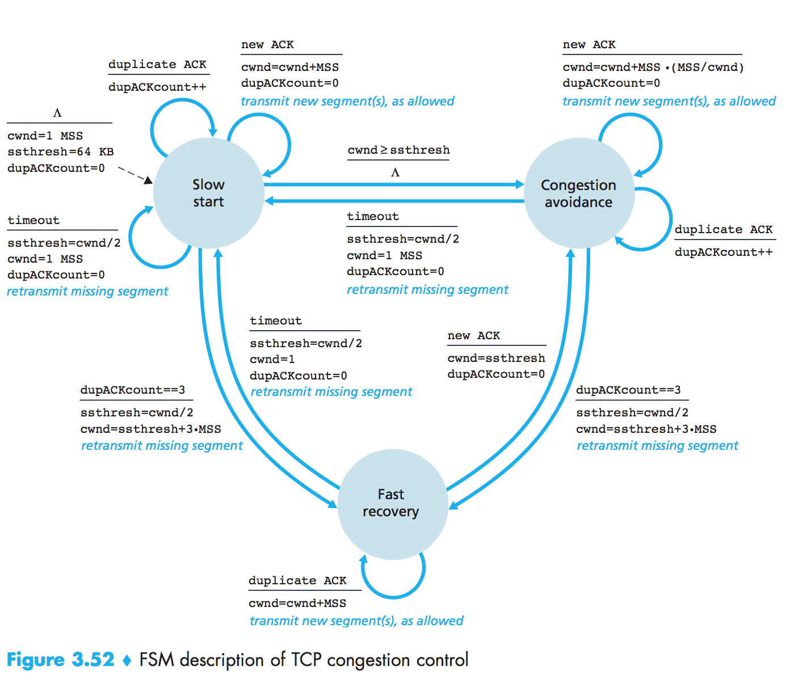
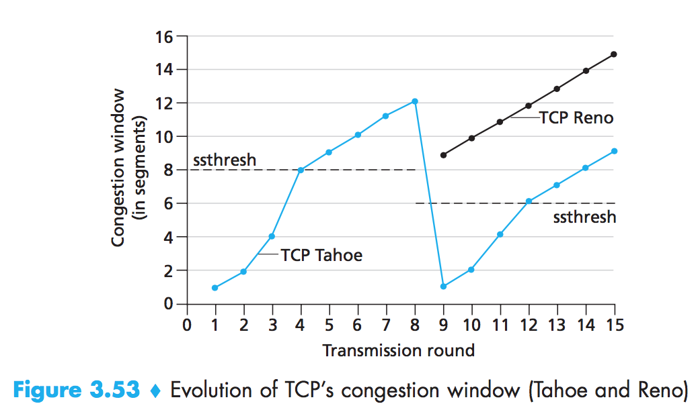

# Final Review

## Cover Range
- 3.5.5 - 6.4
- 6.5 - 6.7
- 7.3.1 - 7.3.2

## Section 3.5 TCP

## Section 3.6 TCP

Transmission Control Protocol

**R16. Consider the Telnet example discussed in Section 3.5. A few seconds after the user types the letter ‘C,’ the user types the letter ‘R.’ After typing the letter ‘R,’ how many segments are sent, and what is put in the sequence number and acknowledgment fields of the segments?**

3 segments.

- First segment: seq = 43, ack = 80, data = `R`;
- Second segment: seq = 80, ack = 44, data = `R`;
- Third segment; seq = 44, ack = 81

## Section 3.7 TCP Congestion Control

## Section 4.1 Overview of Network Layer

**R3. What are the key differences between routing and forwarding?**

- Forwarding is about moving a packet from a router’s input port to the appropriate output port.
- Routing is about determining the end-to-routes between sources and destinations.

**R4. What is the role of the forwarding table within a router?**

A router forwards a packet by examining the value of one or more fields in the arrriving packet's header, and the nusing these header values to index into its forwarding table.

**R5. What is the service model of the Internet's network layer? What guarantees are made by the Internet's service model regarding the host-to-host delivery of datagrams?**

**Best-effort service.** It makes no guarantees.

- Guaranteed delivery
- Guaranteed delivery with bounded dealy
- In-order packet delivery
- Guaranteeed minimal bandwidth
- Security

## Section 4.2 What's inside a router?

**R7. What does each input port of a high speed router store to facilitate fast forwarding decisions?**

With the shadow copy, the forwarding lookup is made locally, at each input port, without invoking the centralized routing processor.

> Such a decentralized approach avoids creating a lookup processing bottleneck at a single point within the router.

**R10. Switching in a router forwards data from an input port to an ourput port. What is the advantage of switching via an interconnection network over switching via memory and switching via bus?**

**Non-blocking.** A packet being forwarded to an output port will not be blocked from reaching that output port as long as no other packet is currently being forwarded to that output port.

**R11. What is the role of a packet scheduler at the output port of a router?**

To determine the order in which quesed packets are transmitted over an outgoing link.

**R12. What is a drop-tail policy? What are AQM algorithms? Which is the most widely studied and implemented AQM algorithm? How does it work?**

Drop the arriving packet when there is not enough memory to buffer an incoming packet.

Active queue management, a collection of proactive packet-dropping and -making policies.

Random Early Detection (RED) algorithm.

> RED monitors the average queue size and drops (or marks when used in conjunction with ECN) packets based on statistical probabilities. If the buffer is almost empty, then all incoming packets are accepted. As the queue grows, the probability for dropping an incoming packet grows too. When the buffer is full, the probability has reached 1 and all incoming packets are dropped.

**R13. What is HOL blocking? Does it occur in inpur ports or output ports?**

A queued in an input queue must wait for transfer throught the fabric because it is blocked by another packet at the head of the line.

HOL blocking occurs at the **input port**.

**R16. What is an essential difference between RR and WFQ packet scheduling?**

Weighted fair queuing (WFQ) differs from round robin (RR) in that each class may receive a differential amount of service in any interval of time.

## Section 4.3 IP

**R31. It has been said that when IPv6 tunnels through IPv4 routers, IPv6 treats the IPv4 tunnels as link-layer protocols. Do you agree with this statement? Why or why not?**

**Yes**, because the entire IPv6 datagram (including header fields) is **encapsulated in an IPv4 datagram**.

## Section 4.4 Generalized Forwarding and SDN

- Match
  - Link layer
  - Network layer
  - Transport layer
- Action
  - Forwarding
  - Dropping
  - Modify-field

...
