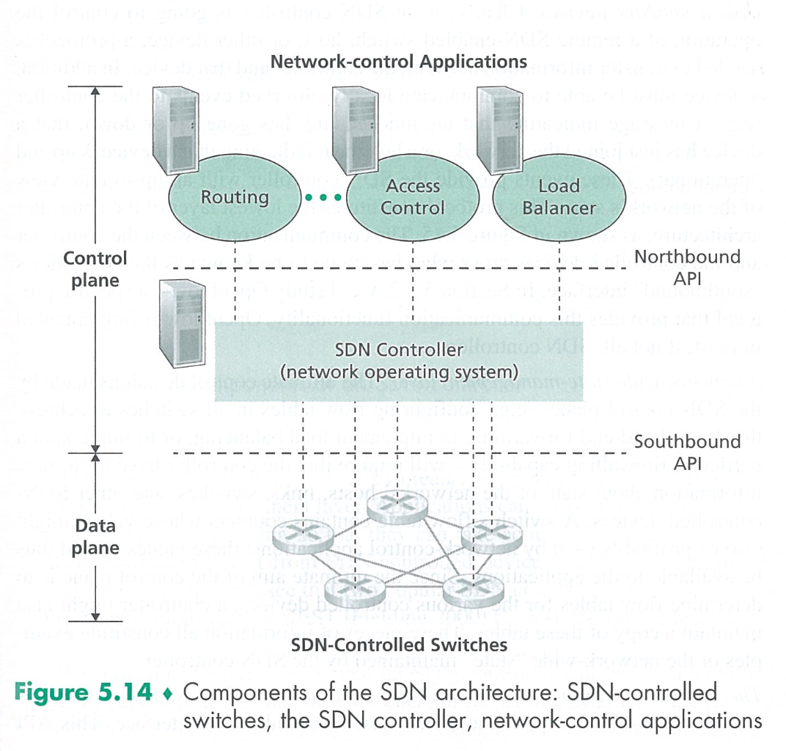
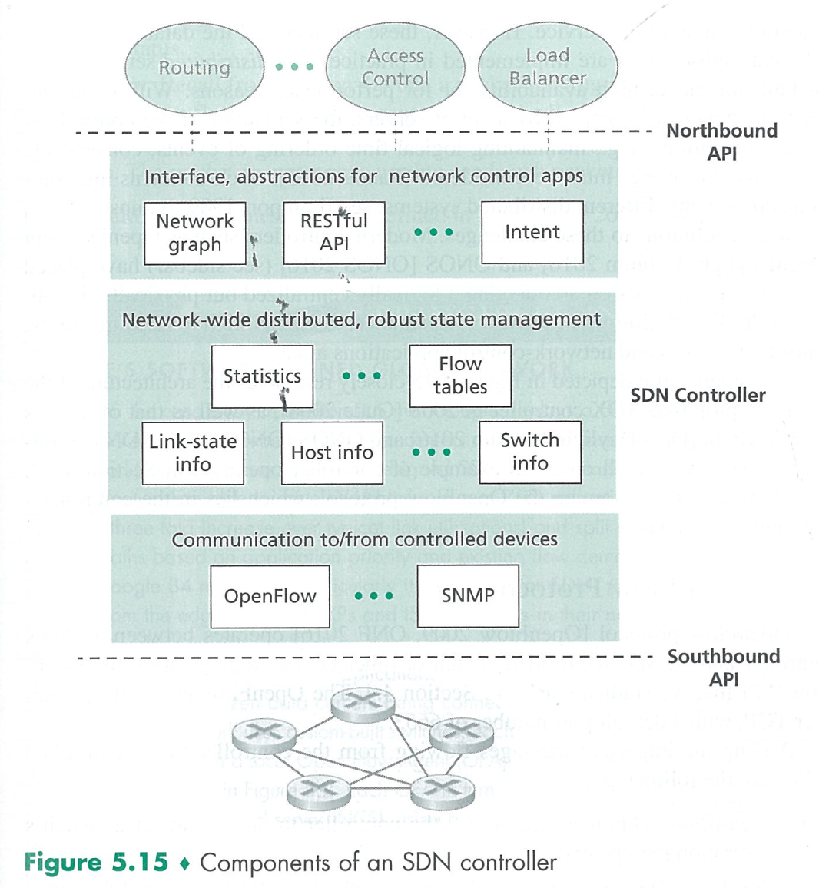

# Final Review

## Cover Range
- 3.5.5 - 6.4
- 6.5 - 6.7
- 7.3.1 - 7.3.2

## Section 3.5 TCP

## Section 3.6 TCP

Transmission Control Protocol

**R16. Consider the Telnet example discussed in Section 3.5. A few seconds after the user types the letter ‘C,’ the user types the letter ‘R.’ After typing the letter ‘R,’ how many segments are sent, and what is put in the sequence number and acknowledgment fields of the segments?**

3 segments.

- First segment: seq = 43, ack = 80, data = `R`;
- Second segment: seq = 80, ack = 44, data = `R`;
- Third segment; seq = 44, ack = 81

## Section 3.7 TCP Congestion Control

## Section 4.1 Overview of Network Layer

**R3. What are the key differences between routing and forwarding?**

- Forwarding is about moving a packet from a router’s input port to the appropriate output port.
- Routing is about determining the end-to-routes between sources and destinations.

**R4. What is the role of the forwarding table within a router?**

A router forwards a packet by examining the value of one or more fields in the arrriving packet's header, and the nusing these header values to index into its forwarding table.

**R5. What is the service model of the Internet's network layer? What guarantees are made by the Internet's service model regarding the host-to-host delivery of datagrams?**

**Best-effort service.** It makes no guarantees.

- Guaranteed delivery
- Guaranteed delivery with bounded dealy
- In-order packet delivery
- Guaranteeed minimal bandwidth
- Security

## Section 4.2 What's inside a router?

**R7. What does each input port of a high speed router store to facilitate fast forwarding decisions?**

With the shadow copy, the forwarding lookup is made locally, at each input port, without invoking the centralized routing processor.

> Such a decentralized approach avoids creating a lookup processing bottleneck at a single point within the router.

**R10. Switching in a router forwards data from an input port to an ourput port. What is the advantage of switching via an interconnection network over switching via memory and switching via bus?**

**Non-blocking.** A packet being forwarded to an output port will not be blocked from reaching that output port as long as no other packet is currently being forwarded to that output port.

**R11. What is the role of a packet scheduler at the output port of a router?**

To determine the order in which quesed packets are transmitted over an outgoing link.

**R12. What is a drop-tail policy? What are AQM algorithms? Which is the most widely studied and implemented AQM algorithm? How does it work?**

Drop the arriving packet when there is not enough memory to buffer an incoming packet.

Active queue management, a collection of proactive packet-dropping and -making policies.

Random Early Detection (RED) algorithm.

> RED monitors the average queue size and drops (or marks when used in conjunction with ECN) packets based on statistical probabilities. If the buffer is almost empty, then all incoming packets are accepted. As the queue grows, the probability for dropping an incoming packet grows too. When the buffer is full, the probability has reached 1 and all incoming packets are dropped.

**R13. What is HOL blocking? Does it occur in inpur ports or output ports?**

A queued in an input queue must wait for transfer throught the fabric because it is blocked by another packet at the head of the line.

HOL blocking occurs at the **input port**.

**R16. What is an essential difference between RR and WFQ packet scheduling?**

Weighted fair queuing (WFQ) differs from round robin (RR) in that each class may receive a differential amount of service in any interval of time.

## Section 4.3 IP

**R31. It has been said that when IPv6 tunnels through IPv4 routers, IPv6 treats the IPv4 tunnels as link-layer protocols. Do you agree with this statement? Why or why not?**

**Yes**, because the entire IPv6 datagram (including header fields) is **encapsulated in an IPv4 datagram**.

## Section 4.4 Generalized Forwarding and SDN

- Match
  - Link layer
  - Network layer
  - Transport layer
- Action
  - Forwarding
  - Dropping
  - Modify-field

## Section 5.2 Routing Algorithms

Count to Infinity Problem

- routing loop

## Section 5.3 Intra-AS Routing In the Internet: OSPF

## Section 5.4 Routing Among the ISPs: BGP

**R9. Why are different inter-AS and intra-AS protocols used in the Internet?**

**Policy**
> Among ASs, policy issues dominate. It may well be important that traffic originating in a given AS not be able to pass through another specific AS. Similarly, a given AS may want to control what transit traffic it carries between other ASs. Within an AS, everything is nominally under the same administrative control and thus policy issues a much less important role in choosing routes with in AS.

**Scale**
> The ability of a routing algorithm and its data structures to scale to handle routing to/among large numbers of networks is a critical issue in inter-AS routing. Within an AS, scalability is less of a concern. For one thing, if a single administrative domain becomes too large, it is always possible to divide it into two ASs and perform inter-AS routing between the two new ASs.

**Performance**
> Because inter-AS routing is so policy oriented, the quality (for example, performance) of the routes used is often of secondary concern (that is, a longer or more costly route that satisfies certain policy criteria may well be taken over a route that is shorter but does not meet that criteria). Indeed, we saw that among ASs, there is not even the notion of cost (other than AS hop count) associated with routes. Within a single AS, however, such policy concerns are of less importance, allowing routing to focus more on the level of performance realized on a route.

**R9. What is meant by an area in an OSPF autonomous system? Why was the concept of an area introduced?**

An OSPF autonomous system can be configured hierarchically into areas. Each area runs its own OSPF link-state routing algorithm, with each router in an area broadcasting its link state to all other routers in that area.

> Within each area, one or more area border routers are responsible for routing packets outside the area. Lastly, exactly one OSPF area in the AS is configured to be the backbone area. The primary role of the backbone area is to route traffic between the other areas in the AS. The backbone always contains all area border routers in the AS and may contain nonborder routers as well. Inter-area routing within the AS requires that the packet be first routed to an area border router (intra-area routing), then routed through the backbone to the area border router that is in the destination area, and then routed to the final destination.

**R10. Define and contrast the following terms: subnet, prefix, and BGP route.**

**A subnet** is a portion of a larger network; a subnet does not contain a router; its boundaries are defined by the router and host interfaces.

**A prefix** is the network portion of a CDIRized address; it is written in the form a.b.c.d/x ; A prefix covers one or more subnets. When a router advertises a prefix across a BGP session, it includes with the prefix a number of BGP attributes.

In BGP jargon, a prefix along with its attributes is a **BGP route** (or simply a route).

**R11. How does BGP use the NEXT-HOP attribute? How does it use the AS-PATH attribute?**

Routers use the **AS-PATH attribute to detect and prevent looping advertisements**; they also use it in **choosing among multiple paths to the same prefix**.

**The NEXT- HOP attribute indicates the IP address of the first router along an advertised path (outside of the AS receiving the advertisement) to a given prefix.** When configuring its forwarding table, a router uses the NEXT-HOP attribute.

**R12. Describe how a network administrator of an upper-tier ISP can implement policy when configuring BGP.**

**A tier-1 ISP B may not to carry transit traffic between two other tier-1 ISPs**, say A and C, with which B has peering agreements.

To implement this policy, ISP B would not advertise to A routes that pass through C; and would not advertise to C routes that pass through A.

## Section 5.5 The SDN Control Plane

**R14. Describe the main role of the communication layer, the network-wide state-management layer, and the network-control layer in an SDN controller.**

- Communication layer
  - communicating between the SDN controller and the controlled network devices.
- Network-wide state-management layer
  - contains network-wide up-to-date state (of hosts, links, switches and other SDN-controlled devices) maintained by the SDN controller, which helps to make the ultimate control decisions.
- Network-control layer
  - this API allows network-control applications to read/write state and flow tables within the state-management layer.

### SDN Architecture

### SDN Controller

## Section 5.6 ICMP: The Internet Control Message Protocol

## Section 5.7 Network Management and SNMP (Simple Network Management Protocol)

**R21. Define the following terms in the context of SNMP: managing server, managed device, network management agent and MIB.**

The **managing server** is an application, typically with a human in the loop, running in a centralized network management station in the network operations center (NOC). It controls the collection, processing, analysis, and/or display of network management information.

A **managed device** is a piece of network equipment (including its software) that resides on a managed network. (host, router, switch, middlebox, modem, thermometer, or other network-connected device).

Each managed object within a managed device associated information that is collected into a **Management Information Base (MIB)**.

A **network management agent** is a process running in the managed device that communicates with the managing server, taking local actions at the managed device under the command and control of the managing server.

...
